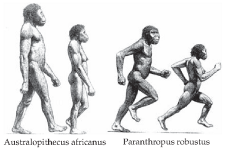

# Who are the primates?

## Generally, we divide primates into grades and clades. What's the difference?

<figure>
  
  <figcaption>Credit: <a href="http://johnhawks.net/explainer/primates/primate-classification-phylogeny/" target="_blank">Primate superfamily phylogeny</a> by John Hawks, CC-BY-NC-ND.</figcaption>
</figure>

## Lemurs are the "primitive" primates living on Madagascar. {.flexbox}

<figure>
  
  <figcaption>Credit: <a href="https://commons.wikimedia.org/wiki/File:Baby_Brown_Mouse_Lemur_(Microcebus_rufus)_(9632294778).jpg" target="_blank">Baby brown mouse lemur</a> by Bernard Dupont, CC-BY-SA 2.0.</figcaption>
</figure>

 

<figure>
  
  <figcaption>Credit: <a href="https://commons.wikimedia.org/wiki/File:Microcebus_murinus_-Artis_Zoo,_Amsterdam,_Netherlands-8c.jpg" target="_blank">Gray mouse lemur</a> by Arjan Haverkamp, CC-BY 2.0.</figcaption>
</figure>

## *Primitive* because they retain many traits of the earliest primates. {.flexbox}

<figure>
  
  <figcaption>Credit: <a href="https://commons.wikimedia.org/wiki/File%3ALemur_Catta02.jpg" target="_blank">Ring-tailed lemur</i></a> by Bernard Gagnon, CC-BY-SA 3.0.</figcaption>
</figure>

 
 

<figure>
  
  <figcaption>Credit: <a href="https://www.flickr.com/photos/berniedup/9598840071/" target="_blank">White-footed sportive lemur</a> by Bernard DUPONT, CC BY-SA 2.0.</figcaption>
</figure>

## Lorises and galagos are small, nocturnal primates.{.flexbox}

 

<figure>
  
  <figcaption>Credit: <a href="https://commons.wikimedia.org/wiki/File%3ASlender_Loris.jpg" target="_blank">Gray slender loris</i></a> by Kalyan Varma, CC-BY-SA 4.0.</figcaption>
</figure>

 
 
 

<figure>
  
  <figcaption>Credit: <a href="https://commons.wikimedia.org/wiki/File%3AGalago.jpg" target="_blank">Galago, or bush-baby</a> by Joachim Huber, CC BY-SA 2.0.</figcaption>
</figure>

## Tarsiers...the cutest primate? {.flexbox .vcenter}

  

  
  

 
 
 

<figure>
  
  <figcaption>Credit: <a href="https://www.flickr.com/photos/peterhellberg/5551104129" target="_blank">Tarsier in the Phillipines</a> by Peter Hellberg, CC BY-SA 2.0.</figcaption>
</figure>

  

## New World monkeys have extra premolars and prehensile tales {.flexbox .vcenter}

  
  

  
  

  
 
 

  

  <figure>
  
  <figcaption>Credit: <a href="https://commons.wikimedia.org/wiki/File%3ACebus_capucinus%2C_Costa_Rica.JPG" target="_blank">White-faced capuchin monkey</a> by Steven G. Johnson, CC BY-SA 3.0.</figcaption>
  </figure>
  
  <!----

  <figure>
  
  <figcaption>Credit: <a href="https://commons.wikimedia.org/wiki/File%3ACebus_capucinus%2C_Costa_Rica.JPG" target="_blank">White-faced capuchin monkey</a> by Steven G. Johnson, CC BY-SA 3.0.</figcaption>
  </figure>-->

  

## Old World Monkeys {.flexbox .vcenter}

  

  
  

  

## Apes (including humans) {.flexbox .vcenter}

  

  
  

  

# Primate mating systems

## Primates vary in social organization, but generally live in complex social groups all year round. {.flexbox .vcenter}

  

  
  

  

## Primates experience both natural selection and sexual selection---males *compete* and females *choose*. {.flexbox .vcenter}

  

  
  

  

## {.flexbox}

Sexual dimorphism is coorelated with inter-male competition for mates.

  

  
  

  

