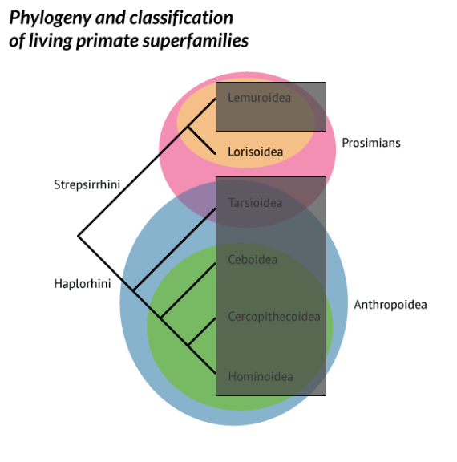

# Who are the primates?

## Generally, we divide primates into grades and clades. What's the difference?

<figure>
  
  <figcaption>Credit: <a href="http://johnhawks.net/explainer/primates/primate-classification-phylogeny/" target="_blank">Primate superfamily phylogeny</a> by John Hawks, CC-BY-NC-ND.</figcaption>
</figure>

## Lemurs are the "primitive" primates living on Madagascar. {.flexbox}

<figure>
  
  <figcaption>Credit: <a href="https://commons.wikimedia.org/wiki/File:Baby_Brown_Mouse_Lemur_(Microcebus_rufus)_(9632294778).jpg" target="_blank">Baby brown mouse lemur</a> by Bernard Dupont, CC-BY-SA 2.0.</figcaption>
</figure>

 

<figure>
  
  <figcaption>Credit: <a href="https://commons.wikimedia.org/wiki/File:Microcebus_murinus_-Artis_Zoo,_Amsterdam,_Netherlands-8c.jpg" target="_blank">Gray mouse lemur</a> by Arjan Haverkamp, CC-BY 2.0.</figcaption>
</figure>

## Lorises and Galagos{.flexbox .vcenter}

  

  
  

  

## Tarsiers {.flexbox .vcenter}

  

  
  

  

## New World Monkeys {.flexbox .vcenter}

  

  
  

  

## Old World Monkeys {.flexbox .vcenter}

  

  
  

  

## Apes (including humans) {.flexbox .vcenter}

  

  
  

  

# Primate sexual behavior

## Primates, like many species, experience sexual selection---males *compete* and females *choose*.