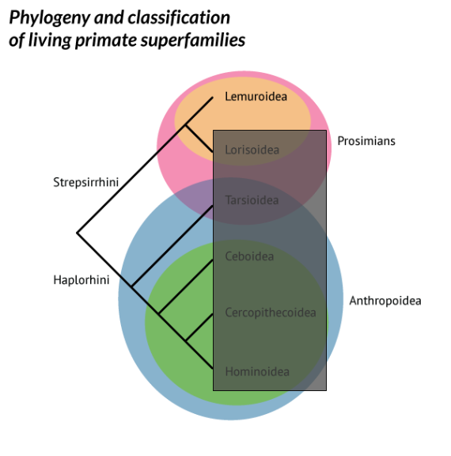

# Who are the primates?

## {.flexbox .vcenter}

## Lemurs {.flexbox .vcenter}

  

  
  

  

## Lorises and Galagos{.flexbox .vcenter}

  

  
  

  

## Tarsiers {.flexbox .vcenter}

  

  
  

  

## New World Monkeys {.flexbox .vcenter}

  

  
  

  

# Primate sexual behavior

## Primates, like many species, experience sexual selection---males *compete* and females *choose*.